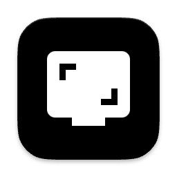

# WindowLockRecorder



Tiny macOS menu bar app for recording one selected window without OBS.

WindowLockRecorder uses ScreenCaptureKit to capture only the selected window in
display space. That keeps unrelated windows out of the recording while still
preserving small whole-window movements in the output. Empty space around the
selected window is filled with gray so it stays visible against dark apps such
as Moonshot.

## Build

```bash
make package
```

The app bundle is written to:

```text
dist/WindowLockRecorder.app
```

Install it like Magnify:

```bash
make install
open /Applications/WindowLockRecorder.app
```

`make install` replaces `/Applications/WindowLockRecorder.app`, refreshes Launch
Services, resets Screen Recording permission for the local bundle ID, and
relaunches the app if it was already running.

## Use

WindowLockRecorder runs as a menu bar app and does not appear in the Dock. Use
the menu bar monitor icon to show or hide the window, refresh the window list,
request Screen Recording permission, or quit.

1. Click Request Permissions if Screen Recording access has not been granted.
2. Click Refresh Windows.
3. Pick a window.
4. Optionally set a duration in seconds. Leave it blank to record until Stop.
5. Set FPS if needed. The default is 120 fps.
6. Click Record.

Recordings are saved automatically to Desktop with a timestamped `.mov`
filename based on the selected app/window.

`Cmd` + `Shift` + `6` hides or shows the app window while the app is running.
When the app is visible but not active, the shortcut brings it forward instead
of hiding it.
